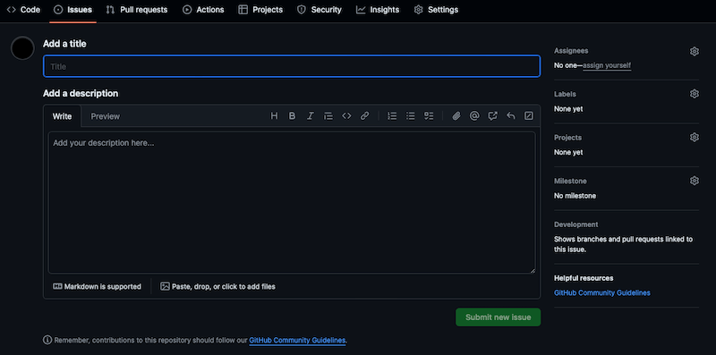
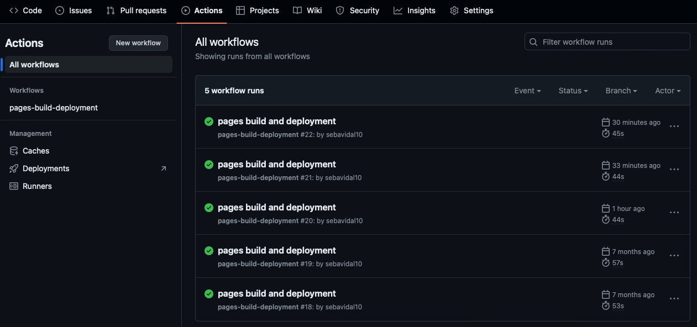

> Git & Github | Sebastián Vidal Aedo | 20240423

- [Introducción](#introducción)
- [Crear, clonar o asociar un repositorio](#crear-clonar-o-asociar-un-repositorio)
  - [Creando un repositorio](#creando-un-repositorio)
  - [Clonando un repositorio](#clonando-un-repositorio)
  - [Asociar un proyecto a un repo](#asociar-un-proyecto-a-un-repo)
- [Revisemos el repo](#revisemos-el-repo)
  - [Verificar el estado del repositorio](#verificar-el-estado-del-repositorio)
  - [Verificar el codigo](#verificar-el-codigo)
  - [Revisar el log](#revisar-el-log)
  - [Ver los cambios](#ver-los-cambios)
- [Del add al push](#del-add-al-push)
  - [Agregar](#agregar)
  - [Confirmar](#confirmar)
    - [¿Qué es un buen mensaje commit?](#qué-es-un-buen-mensaje-commit)
  - [Guardar cambios temporalmente](#guardar-cambios-temporalmente)
  - [Enviar cambios al repositorio remoto](#enviar-cambios-al-repositorio-remoto)
  - [Actualizar el repositorio local](#actualizar-el-repositorio-local)
  - [Crear una rama](#crear-una-rama)
- [Trabajando colaborativamente](#trabajando-colaborativamente)
  - [Desarrollo paralelo, colaborativo, integración de ramas y resolución de conflictos](#desarrollo-paralelo-colaborativo-integración-de-ramas-y-resolución-de-conflictos)
    - [¿Qué es un PR?](#qué-es-un-pr)
  - [Mezclemos: merge, rebase, cherry-pick, revert y reset](#mezclemos-merge-rebase-cherry-pick-revert-y-reset)
    - [Merge](#merge)
    - [Rebase](#rebase)
    - [Cherry-pick](#cherry-pick)
    - [Revert](#revert)
    - [Reset](#reset)
  - [Cirugia mayor: bisect y rebase interactivo](#cirugia-mayor-bisect-y-rebase-interactivo)
    - [Bisect](#bisect)
    - [Rebase interactivo](#rebase-interactivo)
  - [Gestión avanzada de historial y referencias](#gestión-avanzada-de-historial-y-referencias)
  - [Manipulación avanzada del historial de commits](#manipulación-avanzada-del-historial-de-commits)
  - [Comprobación de integridad](#comprobación-de-integridad)
- [Github: La plataforma de desarrollo colaborativo](#github-la-plataforma-de-desarrollo-colaborativo)
  - [1. Seguimiento de problemas y tareas](#1-seguimiento-de-problemas-y-tareas)
    - [¿Cómo funciona?](#cómo-funciona)
  - [2. Integración continua y despliegue continuo (CI/CD)](#2-integración-continua-y-despliegue-continuo-cicd)
    - [El Proyecto](#el-proyecto)
    - [El test](#el-test)
    - [Configuración de herramineta de CI (Github Actions)](#configuración-de-herramineta-de-ci-github-actions)
    - [Construcción y despliegue de la aplicación](#construcción-y-despliegue-de-la-aplicación)
    - [Seguimiento de los resultados de CI/CD](#seguimiento-de-los-resultados-de-cicd)
    - [Github Pages](#github-pages)
  - [3. Wiki del proyecto](#3-wiki-del-proyecto)
    - [¿Cómo se diferencia del README?](#cómo-se-diferencia-del-readme)
  - [4. Exploración y descubrimiento de proyectos](#4-exploración-y-descubrimiento-de-proyectos)

# Introducción

¿Has visto la película 'Kick-Ass'? Recuerda al protagonista, un joven que anhela convertirse en un superhéroe y luchar contra la injusticia. En un giro del destino, un asalto lo deja dañado a nivel neuronal, lo que reduce su capacidad de sentir dolor y elimina su miedo. De manera similar, este libro te ayudará a superar tus miedos a Git y te convertirás en un superhéroe del desarrollo.

Al igual que el protagonista de 'Kick-Ass', nuestro viaje en Git puede ser desafiante y complejo. A menudo nos enfrentamos a comandos y conceptos que nos resultan intimidantes. Pero no te preocupes, iremos de a poco.

Este libro te guiará en los fundamentos de Git, desde la inicialización y clonación de repositorios hasta la exploración del estado de tu proyecto, el trabajo con ramas paralelas y las fusiones de cambios. Pero no hablaremos de historia de Git ni quien lo creo, para eso vamos a [wikipedia](https://es.wikipedia.org/wiki/Git).

Quiero hacer una advertencia: todo lo que encontrarás en este libro está sesgado por mi experiencia personal. Mi objetivo es compartir contigo los errores que cometí en el pasado y brindarte consejos para que evites cometerlos. Mi deseo es que aprendas y crezcas en tus habilidades de desarrollo.

Prepárate para dominar Git y convertirte en un verdadero superhéroe del código. A disfrutar el viaje y vamos por esos `git rebase -i` sin miedo.

Recuerda, el aprendizaje continúa más allá de estas páginas y cada desafío es una oportunidad para crecer y mejorar tus habilidades.

# Crear, clonar o asociar un repositorio

## Creando un repositorio

Comando: `git init`

Comencemos con algo sencillo: iniciar un repositorio con Git es muy fácil. Simplemente creamos un directorio para nuestro proyecto y ejecutamos el comando `git init` dentro de él. Esto creará un directorio oculto llamado `.git` que contiene toda la estructura y los componentes internos de nuestro repositorio. Ahora tenemos Git configurado en nuestro directorio y podemos comenzar a versionar nuestros archivos localmente (aunque aún no lo hemos vinculado a ningún repositorio remoto).

Es importante mencionar que, al iniciar un repositorio con Git, también es recomendable crear un archivo `.gitignore`. Este archivo te permite especificar patrones de archivos o directorios que deseas excluir del control de versiones.

```bash
my-project/
├─ .git/
│  ├─ HEAD
│  ├─ config
│  ├─ objects/
│  ├─ refs/
│  └─ ...
├─ .gitignore
├─ README.md
├─ index.html
├─ styles.css
└─ ...
```

El **.gitignore** contendría algo como:

```bash
# Comentarios: puedes agregar comentarios precediendo la línea con el símbolo #

# Ignorar archivos temporales
*.tmp

# Ignorar directorios de dependencias o módulos
/node_modules/

# Ignorar archivos de configuración local
config.local.ini

# Ignorar archivos de registro o log
*.log

# Ignorar archivos compilados
*.class
*.dll
*.exe

# Ignorar archivos sensibles
secret.key

# Ignorar directorio de imágenes de tamaño grande
/images/large/

# Ignorar archivos con una extensión específica en una ubicación específica
/path/to/file.txt
```

Puedes agregar o quitar patrones según los archivos y directorios que deseas excluir del seguimiento de versiones. Puedes encontrar más información sobre el archivo `.gitignore` en la [documentación oficial de Git](https://git-scm.com/docs/gitignore).

## Clonando un repositorio

Comando: `git clone <url>`

Si tenemos que unirnos a un equipo (o proyecto) que ya tiene su código versionado y disponible en línea, debemos dirigirnos al repositorio y buscar su enlace o URL. Luego, utilizando el comando `git clone <url>`, podemos descargar todo el contenido del repositorio a nuestro equipo local. Este comando creará un directorio con el nombre del repositorio y descargará todos sus archivos y carpetas bajo la rama predeterminada (probablemente `main`).

Es importante destacar que el origen del proyecto puede estar alojado en plataformas populares como GitHub, GitLab, Bitbucket o incluso en un servidor propio. El comando `git clone` funciona de la misma manera sin importar la plataforma de alojamiento, lo único importante es que tengas permisos.

Una vez que hayamos clonado el repositorio, tendremos una copia completa de todo el historial de revisiones y ramas disponibles en el repositorio remoto. Esto nos permitirá colaborar con el equipo, realizar cambios, crear nuevas ramas y enviar nuestras contribuciones mediante **push**.

Por ejemplo:

```bash
git@github.com:usuario/repositorio.git
```

Url formada por:

- `git@github.com`: Esta parte indica que se utiliza el protocolo SSH para la clonación del repositorio. El prefijo "git@" indica que se utilizará la conexión SSH para acceder al repositorio.

- `usuario`: Es el nombre de usuario o la organización a la que pertenece el repositorio en GitHub. Debes reemplazarlo con el nombre de usuario o la organización correcta.

- `repositorio`: Es el nombre del repositorio que deseas clonar. Debes reemplazarlo con el nombre del repositorio correcto.

- `.git`: Es la extensión que indica que se trata de un repositorio Git.

Hace un momento dije que el nombre del directorio que se crea al clonar es el mismo que el del proyecto... esto es solo si no indicamos un nombre específico al final del comando. Por ejemplo, si queremos que nuestro directorio se llame **proyecto-front**, el comando quedaría así `git clone <url> proyecto-front`.

## Asociar un proyecto a un repo

Comando: `git remote add origin <url>`

A veces, tenemos proyectos que son sólo una "Prueba de concepto" por lo que es posible que no esté versionado con Git. Pero no te preocupes, agregar Git a tu proyecto es simple. Primero, necesitaremos crear un repositorio en una plataforma como GitHub, GitLab, Bitbucket o en un servidor propio. Una vez que tengamos nuestro repositorio remoto listo, podemos vincularlo con nuestro repositorio local utilizando el comando `git remote add origin <url>`. Esta acción establecerá una conexión entre nuestro repositorio local y el repositorio remoto, lo que nos permitirá realizar `push` y `pull` de los cambios.

Una vez que hayamos agregado el origen remoto, podemos utilizar comandos como `git push` para enviar nuestros cambios al repositorio remoto y `git pull` para traer los cambios realizados por otros colaboradores al repositorio local. Esto nos permite mantenernos actualizados y trabajar de manera colaborativa en el proyecto.

Ejemplo:

```bash
git remote add origin https://github.com/tu-usuario/tu-repositorio.git
```

Estructura del comando:

- `git`: Es el comando principal de Git.
- `remote add`: Es una subcomando de `git` utilizado para agregar un control remoto al repositorio local.
- `origin`: Es el nombre convencional utilizado para referirse al control remoto, aunque puedes elegir otro nombre si lo deseas. En general, "origin" se utiliza para referirse al repositorio remoto principal.
- `https://github.com/tu-usuario/tu-repositorio.git`: Es la URL del repositorio remoto al que deseas vincular tu repositorio local. Puede ser una URL HTTPS o SSH, dependiendo de cómo esté configurado el repositorio remoto.

Para validar la configuración y verificar que el origen remoto se ha agregado correctamente, puedes abrir el archivo `.git/config` en tu repositorio local. Este archivo contiene la configuración específica del repositorio, incluyendo la referencia al origen remoto.

Siguiendo con el ejemplo, el archivo `.git/config` después de agregar el origen remoto se debería ver algo así:

```bash
[core]
  repositoryformatversion = 0
  filemode = true
  bare = false
  logallrefupdates = true
[remote "origin"]
  url = https://github.com/tu-usuario/tu-repositorio.git
  fetch = +refs/heads/*:refs/remotes/origin/*
```

La sección `[remote "origin"]` contiene la URL del repositorio remoto y la configuración de `fetch`.

Recuerda que este archivo es específico de tu repositorio local y no se reflejará en los demás colaboradores o en el repositorio remoto.

# Revisemos el repo

## Verificar el estado del repositorio

Comando: `git status`

Debe ser de los comandos mas usados, proporciona información importante sobre los archivos en tu directorio de trabajo en relación con el repositorio, en detalle, algunas de las cosas que el comando indica son:

- Archivos modificados desde la ultima confirmación (ultimo commit).
- Archivos nuevos, conocidos tambien como "untracked".
- Archivos eliminados, identificados como "deleted".
- Archivos ya "agregados" y que estan en la zona de preparación (staging area) y están listos para ser confirmados.
- La rama o <i>branch</i> actual en que nos encontramos.

Por si sólo es util, pero hay ciertos atributos que nos permiten ver mas información, como:

`git status -a`

Equivalente a --all, muestra información sobre todos los archivos en el repositorio, incluso aquellos que no han sido modificados o agregados recientemente. Por defecto, git status solo muestra información sobre los archivos modificados y los que están en la zona de preparación (staging area). Al usar -a, se incluyen en el resultado todos los archivos rastreados por Git.

`git status -s`

Equivalente a --short, proporciona una salida más concisa y resumida del estado de los archivos. En lugar de mostrar la información detallada, como los nombres de los archivos modificados, eliminados o agregados, git status -s muestra un resumen más compacto utilizando un formato de dos columnas. La primera columna muestra el estado de los archivos en la zona de preparación, y la segunda columna muestra el estado de los archivos en el directorio de trabajo.

```bash
  M archivo_modificado.txt
  A archivo_nuevo.txt
  D archivo_eliminado.txt
```

En este ejemplo, "M" indica que archivo_modificado.txt ha sido modificado, "A" indica que archivo_nuevo.txt es un archivo nuevo y "D" indica que archivo_eliminado.txt ha sido eliminado.

## Verificar el codigo

Comando: `git blame`


Muchas veces nos encontramos con un código y nos preguntamos: '¿Quién hizo esto?' En ocasiones, el autor somos nosotros mismos, pero si no es así, podemos utilizar el comando `git blame` para averiguar quién fue el responsable de escribir ese código y, en caso de necesitar ayuda para entenderlo, poder contactarlo directamente.

El uso básico del comando `git blame` es el siguiente:

```bash
git blame [nombre de archivo]
```

Esto mostrará una salida que enumera cada línea del archivo, junto con la información del commit y el autor responsable de la última modificación de cada línea.

Aquí tienes un ejemplo de cómo se vería la salida del comando `git blame`:

```bash
^f7a29cd (Autor A 2022-02-01 14:30:55 1) Línea 1 del archivo
^3a2b0dc (Autor B 2022-02-03 09:45:12 2) Línea 2 del archivo
^f7a29cd (Autor A 2022-02-01 14:30:55 3) Línea 3 del archivo
```

En este ejemplo, las líneas 1 y 3 del archivo fueron modificadas por el Autor A en el commit `f7a29cd`, mientras que la línea 2 fue modificada por el Autor B en el commit `3a2b0dc`.

Es importante destacar que `git blame` no tiene una connotación negativa; se utiliza para rastrear la autoría y la historia del código y es una herramienta útil para entender quién ha realizado cambios en un archivo en particular.

## Revisar el log

Comando: `git log`

Uno de los beneficios de versionar es conocer la historia, esto se puede hacer viendo "logs", que nos muestran los commits realizados en el repositorio. Especificamente cuando hacemos git log aparece algo asi:

```bash
  commit c1e23f5789aef7a0b9b3f7e80c3c43b7e4f2d7a1
  Author: Nombre del autor <correo@ejemplo.com>
  Date:   Mié May 24 10:00:00 2023 -0500

      Añadida funcionalidad de autenticación de usuarios

  commit 4f8e9a7b62c1b73e491cf3f804b8c3aa8fa2ae02
  Author: Nombre del autor <correo@ejemplo.com>
  Date:   Mar May 23 15:30:00 2023 -0500

      Corrección de bug en la función de validación

  commit 2a3bcd1c8f91f630ea047b0e12882e0f9f0a42c5
  Author: Nombre del autor <correo@ejemplo.com>
  Date:   Lun May 22 09:45:00 2023 -0500

      Actualización de archivo de configuración
```

Donde se nos muestra el hash del commit, el autor, la fecha y el mensaje del commit (más adelante algunos tips para un buen commit).

( Sales de esta "vista" con la letra <q> )

Al igual que con el comando git status, git log tiene algunas opciones que permiten personalizar la salida del comando.

`git log --oneline`

Esta opción muestra el historial de commits en una forma más compacta y resumida. Cada commit se muestra en una sola línea, con un identificador abreviado del commit (hash) y el mensaje del commit.

```bash
  2a3bcd1 Actualización de archivo de configuración
  4f8e9a7 Corrección de bug en la función de validación
  c1e23f5 Añadida funcionalidad de autenticación de usuarios
```

`git log --oneline --decorate --graph --all`

Esta combinación de opciones proporciona una vista más detallada y gráfica del historial de commits.

<b>--decorate</b> agrega etiquetas y referencias de ramas junto a los commits correspondientes  
<b>--graph</b> muestra el historial de commits en forma de grafo, lo que permite visualizar las ramificaciones y fusiones del proyecto.  
<b>--all</b> muestra todos los commits de todas las ramas, incluyendo las ramas remotas.

```bash
  * 2a3bcd1 (HEAD -> master) Actualización de archivo de configuración
  *   4f8e9a7 Corrección de bug en la función de validación
  |\
  | * c3d25b2 (feature/nueva-funcionalidad) Añadida nueva funcionalidad
  |/
  * c1e23f5 Añadida funcionalidad de autenticación de usuarios
```

## Ver los cambios

Comando: `git diff`

`git status` nos muestra los archivos que han sido modificados, pero no nos muestra los cambios que se han hecho en ellos. Para ver los cambios usamos `git diff`:

```bash
  diff --git a/archivo_modificado.txt b/archivo_modificado.txt
  index 2e65efe..f1a5a5e 100644
  --- a/archivo_modificado.txt
  +++ b/archivo_modificado.txt
  @@ -1 +1,2 @@
  +Este es un archivo modificado
  -Este es un archivo modificado
```

es un poco confuso, por eso hay otras herramientas dentro de los editores de codigo que nos facilitan la tarea, pero para evidenciar cambios pequeños es util y saca de apuros.

# Del add al push

Lo importante: tomamos un tarea, programamos, solucionamos y la tenemos lista para compartirla con el equipo. ¿Cómo lo hacemos usando **git**?

## Agregar

Comando: `git add <file>`

Podemos agregar los cambios de forma individual con `git add <file>` o todos a la vez con `git add .`

## Confirmar

Comando: `git commit -m "mensaje"`

Para confirmar o "asegurar" los cambios usamos `git commit -m "mensaje"` donde el mensaje es una descripción corta de los cambios realizados, bueno mucho mas que eso.

### ¿Qué es un buen mensaje commit?

Segun mi experiencia, chatGPT y un par de blogs, un buen commit tiene al menos estas 5 caracteristicas:

1. Identificar que se hizo (feature, fix, hot-fix, etc).
2. Claridad y concisión.
3. Objetivo del commit.
4. Simple en su Lenguaje.
5. Debe seguir un formato.

Por ejemplo:

```bash
  Fix: Corregir error de validación de email en el formulario de registro
```

Algunos commit malos (que abundan):

```bash
Cambios varios
```

```bash
Arreglar bug
```

```bash
Commit final
```

```bash
Hacer cambios
```

```bash
Oops
```

## Guardar cambios temporalmente

Comando: `git stash`

Supongamos que estás trabajando en una nueva función en tu rama actual, pero en medio del proceso, te das cuenta de que es necesario corregir un error urgente en otra parte del código. Sin embargo, no quieres hacer un commit incompleto de tus cambios en la función actual. En este escenario, puedes utilizar `git stash`:

1. Ejecutas `git stash` y Git guarda temporalmente tus cambios en un stash, dejando tu directorio de trabajo limpio.
2. Realizas las correcciones necesarias para solucionar el error en una rama diferente o en la misma rama.
3. Una vez que hayas resuelto el error, vuelves a tu rama original donde guardaste los cambios.
4. Utilizas `git stash apply` para aplicar los cambios guardados desde el stash en tu rama actual. Los cambios se aplican, pero el stash todavía se mantiene.
5. Continúas trabajando en la función y, cuando estés listo, realizas un commit adecuado.
6. Si ya no necesitas el stash y deseas eliminarlo, puedes usar `git stash drop` para eliminarlo de manera permanente.

Alternativamente, en lugar de usar `git stash apply`, puedes utilizar `git stash pop`. La diferencia es que `stash apply` aplica los cambios del stash, pero mantiene el stash intacto, mientras que `stash pop` aplica los cambios y elimina automáticamente el stash después de aplicarlo.

## Enviar cambios al repositorio remoto

Comando: `git push <remote> <branch>`

Para enviar los cambios al repositorio remoto usamos `git push <remote> <branch>`, donde remote es el nombre del repositorio remoto (por defecto, origin) y branch es el nombre de la rama donde se van a subir los cambios (muchas veces la rama en la que estamos actualmente).

Por ejemplo, si tuvieramos cambios en nuestra rama_local y quisieramos subirlos, los agregamos, hacemos el commit y luego

`git push origin rama_local`

Ahora, si queremos forzarlo, es decir, que no nos importa si alguien más (o incluso nosotros mismos) subió cambios y queremos sobreescribirlos, usamos el signo + antes del nombre de la rama:

`git push origin +rama_local:rama_local`

## Actualizar el repositorio local

Comando: `git pull <remote> <branch>`

Para actualizar el repositorio local con los cambios que se han subido al repositorio remoto usamos `git pull <remote> <branch>`, donde remote es el nombre del repositorio remoto (por defecto, origin) y branch es el nombre de la rama donde se van a bajar los cambios (muchas veces la rama en la que estamos actualmente). Esto es una excelente practica a realizar cada vez que se inicia una tarea, asi nuestros cambios "nacen" desde la ultima version del proyecto.

Por ejemplo:

`git pull origin development`

luego podemos crear nuestra nueva rama y trabajar en ella, partiendo de la ultima version del proyecto.

## Crear una rama

Comando: `git branch <nombre>`

Este comando se utiliza para crear una nueva rama en el repositorio con el nombre especificado. Por ejemplo, si ejecutas git branch nueva-funcionalidad, se creará una nueva rama llamada "nueva-funcionalidad" a partir del commit actual. Sin embargo, este comando no cambia a la nueva rama, sino que simplemente la crea, para ahorrar tiempo podemos usar:

- `git branch -b <nombre>`: Este comando combina la creación de una nueva rama y el cambio a esa rama en un solo paso. Al ejecutar git branch -b nueva-funcionalidad, se creará una nueva rama llamada "nueva-funcionalidad" a partir del commit actual y se cambiará a esa rama automáticamente. Es una forma conveniente de crear y moverse a una nueva rama en un solo comando

- `git checkout -b <nombre>`: Similar al comando anterior, este comando también crea una nueva rama y cambia a ella en un solo paso. Al ejecutar git checkout -b nueva-funcionalidad, se creará una nueva rama llamada "nueva-funcionalidad" a partir del commit actual y se cambiará a esa rama automáticamente. Es otra forma conveniente de crear y moverse a una nueva rama. Por mucho el mas habitual.

# Trabajando colaborativamente

## Desarrollo paralelo, colaborativo, integración de ramas y resolución de conflictos

Hasta aqui es lo habitual que vemos en un curso de git y lo que es probable que dominemos muy bien si trabajamos solos, pero al trabajar en equipo la realidad cambia ya que no solo tenemos que crear ramas, sino que tenemos que integrarlas, solucionar conflictos, opinar sobre los cambios de otros desarrolladores, etc. y eso es complejo, pero no imposible.

Lo primero a la hora de buscar una forma de trabajar con git es GitFlow. Si venimos de trabajar solos, se va a sentir como un cambio radical, engorroso, complejo y hasta rigido. Creo que al igual que con muchas cosas entorno a la tecnología, el consejo es tomar lo "mejor" (de GitFlow en este caso) y ajustarlo a nuestra realidad como equipo. Un buen punto de inicio para proponer a un equipo "nuevo" podria basarse en lo siguiente (e ir creciendo / cambiando en base a la madurez del equipo):

1. Tengamos 2 ramas base: main y development. Main es sagrada y todo "debería" funcionar bien ahí.
2. Hay **un** responsable de integrar a Main.
3. Crear ramas por tarea, no por persona (acordar una estructura, por ejemplo `tipo/usuario/tarea`).
4. Usar PRs con al menos 2 reviewers por tarea.
5. Hacer rebase (más adelante se detalla "qué es" un rebase) antes de subir cambios (asi ahorramos conflictos).

Antes de continuar...

### ¿Qué es un PR?

Un PR (Pull Request) en GitHub es una solicitud para fusionar cambios que has hecho en tu repositorio con otro repositorio. Imagina que tienes una copia de un proyecto en tu cuenta de GitHub y quieres agregar algunas mejoras o correcciones a ese proyecto. En lugar de hacer los cambios directamente en el repositorio original, puedes crear un PR para proponer tus cambios.

Cuando creas un PR, le estás diciendo al propietario del repositorio original: "Hey, aquí están los cambios que hice en mi copia. Por favor, échales un vistazo y considera fusionarlos con tu proyecto principal". Esto permite una revisión y discusión de los cambios propuestos antes de que sean realmente incorporados al repositorio original.

El PR proporciona un lugar donde otros desarrolladores pueden comentar tus cambios, hacer sugerencias o pedir aclaraciones. Esto fomenta la colaboración y ayuda a mantener la calidad del código. Una vez que el propietario del repositorio original revisa y aprueba tus cambios, puede fusionarlos, lo que significa que tus contribuciones se incluirán en el proyecto principal.

Dejar comentarios puede resultar difícil, ya que no es cómodo criticar el trabajo de un compañero de equipo. Sin embargo, es altamente útil y contribuye a lograr un proyecto de mejor calidad. Algunos ejemplos de buenos comentarios podrían ser los siguientes:

1. **Reconocimiento y sugerencia de mejora:** "Excelente trabajo en la implementación. Solo quería sugerir que podríamos optimizar este fragmento de código utilizando una función nativa de Python en lugar de iterar manualmente sobre la lista."

2. **Pregunta para aclaración:** "Estoy revisando el código y me gustaría entender mejor cómo funciona esta sección para asegurarnos de que cumpla con nuestras expectativas. ¿Podrías proporcionar más detalles sobre la lógica detrás de esta parte del código?"

Por último, es importante destacar que no se requiere un amplio contexto para ser un revisor efectivo. La calidad del software, en su mayoría, es independiente de la complejidad del mismo. Por ejemplo, un desarrollador junior puede ser un excelente revisor de código, ya que puede detectar errores que un desarrollador senior no puede ver debido a su fresca perspectiva. Por lo tanto, no es necesario ser un experto en el dominio del problema para ser un buen revisor de código.

Sigamos :)

Ejemplo de un flujo donde tenemos a John y Jane trabajando en paralelo en 2 tareas distintas, y luego integrando sus cambios en development.

John:

- Crea la rama `feature/nueva-funcionalidad`

  ```bash
  git checkout -b feature/nueva-funcionalidad
  ```

- Trabaja en la rama `feature/nueva-funcionalidad`
- Realiza cambios, agregar y commit en su rama

  ```bash
  git add .
  git commit -m "Fix: Corregir error de validación de email en el formulario de registro"
  ```

- Actualiza development y realiza rebase en su rama

  ```bash
   git checkout development
   git pull origin development
   git checkout feature/nueva-funcionalidad
   git rebase --np-ff development
  ```

- Crea el Pull Request

  ```bash
   git push origin feature/nueva-funcionalidad
  ```

  Al hacer esto se nos entregara un link para crear el PR, lo creamos y asignamos a los revisores.

- Espera la revisión y aprobación por los revisores. Si demoran en estar los comentarios, es responsabilidad de quien creo el PR que su tarea sea "comentada" o "aprobada", esto esta asociado a la responsabilidad de la tarea desarrollada. El ticket no termina cuando hago el PR, termina cuando mis cambios se mezclaron con development.

- Fusiona (merge) el Pull Request en `development`

Jane:

- Crea la rama `bugfix/correcion-error`

  ```bash
  git checkout -b bugfix/correcion-error
  ```

- Trabaja en la rama `bugfix/correcion-error`
- Realiza cambios, agregar y commit en su rama

  ```bash
  git add .
  git commit -m "Fix: Corregir error de validación de email en el formulario de registro"
  ```

- Olvida el rebase e y sube los cambios

  ```bash
  git push origin bugfix/correcion-error
  ```

- Al realizar el PR ve que hay conflictos que debe solucionar.

  Resolución del conflicto:

  1. Jane actualiza development

     ```bash
     git checkout development
     git pull origin development
     ```

  2. Vuelve a su rama

     ```bash
     git checkout bugfix/correcion-error
     ```

  3. Realizama el rebase

     ```bash
     git rebase development
     ```

  4. Se detectan conflictos entre los cambios de Jane y los cambios en la rama development, algo como:

     ```bash
     <<<<<<< HEAD
     Este es el contenido actual de la línea en conflicto.
     =======
     Este es el contenido propuesto en la rama `feature/nueva-funcionalidad`.
     >>>>>>> feature/nueva-funcionalidad
     ```

     Ambas secciones muestran las opciones en conflicto. Para resolverlo debes elegir qué parte del contenido deseas conservar (pueden ser ambas).

  Después de realizar las modificaciones, deberás guardar el archivo y _agregarlo_ con `git add <nombre del archivo>`.

  Cuando termine de corregir los conflictos y agregar los archivos actualizados, puede continuar con el proceso de rebase mediante `git rebase --continue`.

  Por ultimo, debe actualziar su PR con los codigos ajustados y sin conflicots. Si se hace un psuh "normal" habrá errores, ya que las referencias de tiempo y origen son distintas a las orgiinales, por lo se que debe **forzar** la subida haciendo `git push origin +bugfix/correcion-error:bugfix/correcion-error`. Luego todo sigue como en el caso de John.

- Revisión y aprobación por los revisores

- Fusiona (merge) el Pull Request en `development`

Esto debe ser de lo más complicado y paradojicamente habitual, siempre hay miedo de hacer un rebase y los errores ocurriran, lo importante es ir mejorando, ganando confianza y aumentando el control de git como herramienta. Con el tiempo uno se familiariza y los rebase se convierten en pan de cada día.

En conclusión, si tomamos en cuenta todo lo anterior, y le sumamos buenos mensajes de commit todo deberia andar bien. Podriamos sumar algo higienico como borrar las ramas ya mezcladas, pero eso es opcional.

## Mezclemos: merge, rebase, cherry-pick, revert y reset

### Merge

El **merge** fusiona los commits de una rama en otra. Por ejemplo si estamos en **main** y queremos traer los cambios de **development** hacemos:

```bash
git checkout main
git merge development
```

Esto fusionará los cambios de "development" en "main" creando un **nuevo commit** de fusión.

A pesar que el objetivo es mezclar ramas, al igual que un PR, este ultimo es considerado una mejor practica en equipos de desarrollo, ya que las revisiones (comentarios y sugerencias) son una manera excelente de mejorar el codigo resultante y de que el equipo interactue mediante criticas constructivas. En otras palabras, **es bueno mezclar haciendo merge, pero es mejor hacer PR**.

### Rebase

Hablamos de esto en la parte de "Resolución de coflictos", pero ahora lo veremos más en detalle.

El rebase es una operación en Git que te permite cambiar el punto de origen de una rama. En lugar de fusionar cambios directamente, el rebase toma los commits de una rama y los aplica sobre otra rama (en el futuro), lo que altera la secuencia de commits en la historia del repositorio.

Uno de sus usos mas habituales es "cambiar el origen" para que no existan conflictos y es una buena practica realizarlo antes de subir nuestros codigo. Por ejemplo, si nuestra rama nacio del branch development, y este ha sido actualizado, podemos hacer un rebase para que nuestra rama tenga como origen el ultimo commit de development, y asi evitar conflictos.

Hay un ejemplo paso-a-paso en el capitulo anterior, por lo que acá con un diagrama es suficiente:

Antes del rebase:

```
A --- B --- C  (master)
      \
      D --- E --- F  (feature)
```

Después del rebase:

```
A --- B --- C  (master)
               \
               D' --- E' --- F'  (feature)
```

### Cherry-pick

El cherry-pick es una operación en Git que te permite tomar un commit específico de una rama y aplicarlo sobre otra. En lugar de fusionar ramas completas, como lo hace git merge, el cherry-pick se enfoca en un solo commit. Por ejemplo:

1. Supongamos que tenemos este `git log`:

   ```bash
   commit abcd1234 (HEAD)
   Author: Usuario A
   Date:   Mon May 10 15:30:00 2023
   Message: Agregada funcionalidad X

   commit efgh5678
   Author: Usuario B
   Date:   Fri May 7 09:45:00 2023
   Message: Corregido bug Y

   commit ijkl9012
   Author: Usuario A
   Date:   Tue May 4 18:20:00 2023
   Message: Agregada funcionalidad Z
   ```

2. Ahora, supongamos que estamos en una rama llamada "feature/branch" y queremos aplicar el commit "efgh5678" en esta rama utilizando cherry-pick.

   ```bash
   git cherry-pick efgh5678
   ```

   Git aplicará el contenido y los cambios del commit "efgh5678" en la rama actual, creando un nuevo commit con un nuevo identificador único.

3. Después del cherry-pick, el log se vería así:

   ```bash
   commit xyzw7890 (HEAD)
   Author: Usuario A
   Date:   Mon May 10 16:00:00 2023
   Message: Corregido bug Y (cherry-pick)

   commit abcd1234
   Author: Usuario A
   Date:   Mon May 10 15:30:00 2023
   Message: Agregada funcionalidad X

   commit efgh5678
   Author: Usuario B
   Date:   Fri May 7 09:45:00 2023
   Message: Corregido bug Y

   commit ijkl9012
   Author: Usuario A
   Date:   Tue May 4 18:20:00 2023
   Message: Agregada funcionalidad Z
   ```

Hay un nuevo commit "xyzw7890" con el mensaje "Corregido bug Y (cherry-pick)" en la rama "feature/branch". Esto representa la aplicación exitosa del commit "efgh5678" en la rama actual mediante cherry-pick.

Veamos un diagrama de ejemplo:
Antes del cherry-pick:

```bash
               A --- B --- C --- D --- E  (branch)
               /
... --- X --- Y --- Z  (base)
```

En este ejemplo, tenemos una rama llamada "branch" que tiene varios commits (A, B, C, D, E). Además, hay una rama base llamada "base" que contiene algunos commits (X, Y, Z).

Supongamos que queremos aplicar el commit "C" de la rama "branch" en la rama "base" sin llevarnos todos los commits anteriores. Utilizaremos el comando git cherry-pick para lograr esto.

El diagrama después de aplicar cherry-pick se vería así:

```bash
               A --- B --- C --- D --- E  (branch)
               /
... --- X --- Y --- Z --- C'  (base)
```

El commit "C" se aplica como un nuevo commit "C'" en la rama "base". A diferencia de un rebase, que reescribe la historia de la rama, el cherry-pick crea un nuevo commit con el mismo contenido que el commit seleccionado.

### Revert

El revert, como lo indica su nombre, permite revertir un commit, o varios, o todos.

1. Revertir un commit específico:

   ```bash
     git revert <commit-hash>
   ```

   Esta variante crea un nuevo commit que deshace los cambios realizados en el commit especificado. Es útil cuando deseas deshacer un cambio específico sin eliminarlo del historial de commits. El commit revertido se mantiene en el historial y se crea un nuevo commit que deshace sus cambios.

2. Revertir varios commits:

   ```bash
   git revert <commit-hash1> <commit-hash2> ...
   ```

   Puedes utilizar esta variante para deshacer múltiples commits en orden inverso. Crea un nuevo commit para cada commit especificado, revirtiendo los cambios introducidos en cada uno de ellos. Es útil cuando deseas deshacer una serie de commits en el orden en que fueron realizados.

3. Revertir un rango de commits:

   ```bash
   git revert <commit-hash1>..<commit-hash2>
   ```

   Esta variante permite revertir un rango de commits. Crea un nuevo commit para cada commit en el rango especificado, deshaciendo los cambios de cada uno. Es útil cuando deseas deshacer todos los cambios introducidos en un rango de commits.

4. Revertir un commit y forzar un nuevo commit de revert:

   ```bash
   git revert -n <commit-hash>
   ```

   Al usar la opción `-n` (o `--no-commit`), el comando deshace los cambios en tu directorio de trabajo pero no crea automáticamente un nuevo commit. Te brinda la oportunidad de revisar y ajustar los cambios antes de realizar el commit de revert manualmente con `git commit`. Es útil cuando deseas personalizar el mensaje del commit de revert o realizar ajustes adicionales antes de confirmar los cambios.

Recuerda que el comando `git revert` se utiliza para deshacer cambios de manera segura y preservar el historial de commits. Cada variante te permite revertir cambios específicos en diferentes contextos, ya sea un commit individual, múltiples commits o un rango de commits. Antes de utilizar `git revert`, asegúrate de comprender las implicaciones y realizar pruebas en un entorno de desarrollo para evitar afectar el repositorio en producción.

### Reset

Se utiliza para deshacer cambios en el historial de commits, mover la rama actual o restablecer el estado del directorio de trabajo a un estado específico en el historial de commits.

Aquí tienes un ejemplo de log en formato `--oneline` para ilustrar los diferentes usos de `git reset`:

```bash
abc1234 (HEAD -> main) Último commit
def5678 Otro commit
ghi9012 Commit anterior
```

1. Deshacer el último commit y mantener los cambios para una nueva confirmación (`--soft`):

```bash
git reset --soft HEAD~1
```

Resultado del log después del reset:

```bash
def5678 (HEAD -> main) Otro commit
ghi9012 Commit anterior
```

En este caso, el commit "abc1234" se deshace, pero los cambios se mantienen en el área de preparación (staging area) para una nueva confirmación.

2. Deshacer el último commit y descartar los cambios en el área de preparación (`--mixed`):

```bash
git reset --mixed HEAD~1
```

Resultado del log después del reset:

```bash
def5678 (HEAD -> main) Otro commit
ghi9012 Commit anterior
```

En este caso, el commit "abc1234" se deshace y los cambios en el área de preparación se descartan, pero los cambios realizados en los archivos permanecen en el directorio de trabajo.

3. Deshacer el último commit y descartar todos los cambios realizados (`--hard`):

```bash
git reset --hard HEAD~1
```

Resultado del log después del reset:

```bash
def5678 (HEAD -> main) Otro commit
ghi9012 Commit anterior
```

En este caso, el commit "abc1234" se deshace y se descartan tanto los cambios en el área de preparación como los cambios realizados en los archivos del directorio de trabajo.

Recuerda que estos ejemplos son solo ilustrativos y los resultados pueden variar según el estado y los cambios en tu propio repositorio. Siempre es recomendable realizar una copia de seguridad o estar seguro de los cambios que se deshacen antes de ejecutar `git reset --hard`, ya que los cambios deshechos no se pueden recuperar fácilmente después de este reset.

## Cirugia mayor: bisect y rebase interactivo

Ahora se vienen comandos más avanzados, claramente para resolver problemas más complejos.

### Bisect

Bisect te ayuda a encontrar el commit específico que introdujo un problema o bug en tu código. Utiliza una búsqueda binaria para realizar una serie de pruebas en diferentes commits y encontrar el commit problemático de manera eficiente.

Un ejemplo, supongamos que tenemos esta salida de log:

```bash
a1b2c3d (HEAD -> main) Agregada funcionalidad X
e4f5g6h Corregido bug Y
i7j8k9l Agregada funcionalidad Z
m0n1o2p Actualizado archivo README.md
q3r4s5t Corregido estilo CSS
u6v7w8x Añadido archivo index.html
y9z0a1b Inicializado repositorio
```

1. Ejecuta el comando `git bisect start` para iniciar el proceso de **búsqueda binaria**:

   ```bash
   git bisect start
   ```

2. Indica a Git el commit bueno (funcionando correctamente):

   ```bash
   git bisect good y9z0a1b
   ```

3. Indica a Git el commit malo (con el problema):

   ```
   git bisect bad a1b2c3d
   ```

4. Git **seleccionará automáticamente un commit intermedio** para probar e incluso te dira en cuantos pasos como máximo daremos con el commit problematico.

5. Prueba el código y marcalo según corresponda:

   - Código correcto `git bisect good`
   - Código con error `git bisect bad`.

6. Repite los pasos 4 y 5 hasta que Git encuentre el commit problemático. Luego puedes hacer `git bisect reset` para volver al estado original (sabiendo cual era el problema).

Es importante tener un conocimiento previo del estado del código y seleccionar correctamente los commits buenos y malos para que la búsqueda binaria pueda identificar el commit problemático de manera efectiva.

### Rebase interactivo

Hicimos commits, el tiempo paso y la "historia" se ve muy mal. Con un **rebase -i** podemos modificar, reorganizar o combinar los commits. Permite editar los mensajes, fusionar commits, omitirlos o reordenarlos.

A continuación ejemplos de `git rebase -i` que parten del siguiente `git log`:

```bash
a1b2c3d (HEAD -> main) Agregada funcionalidad X
e4f5g6h Corregido bug Y
i7j8k9l Agregada funcionalidad Z
m0n1o2p Actualizado archivo README.md
```

1. Edición de mensajes de commit

```bash
git rebase -i HEAD~4
```

Se abrirá el editor de texto con el archivo interactivo.

```bash
pick a1b2c3d Agregada funcionalidad X
reword e4f5g6h Corregido bug Y
pick i7j8k9l Agregada funcionalidad Z
pick m0n1o2p Actualizado archivo README.md
```

Cambia **pick** a **reword** para el commit "e4f5g6h". Guarda y cierra el editor de texto.

Aparecerá otro editor con el mensaje del commit "e4f5g6h". Edita el mensaje según tus necesidades, guarda y cierra el editor.

Después del rebase:

```bash
a1b2c3d (HEAD -> main) Agregada funcionalidad X
e4f5g6h Corregido bug Y
i7j8k9l Agregada funcionalidad Z
m0n1o2p Actualizado archivo README.md
```

2. Fusión de commits

```bash
git rebase -i HEAD~4
```

Se abrirá el editor de texto con el archivo interactivo.

```bash
pick a1b2c3d Agregada funcionalidad X
squash e4f5g6h Corregido bug Y
pick i7j8k9l Agregada funcionalidad Z
pick m0n1o2p Actualizado archivo README.md
```

Cambia **pick** a **squash** para el commit "e4f5g6h". Guarda y cierra el editor de texto.

Aparecerá otro editor para combinar los mensajes de los commits. Edita el mensaje según tus necesidades, guarda y cierra el editor.

Después del rebase:

```bash
a1b2c3d (HEAD -> main) Agregada funcionalidad X
e4f5g6h Corregido bug Y y Agregada funcionalidad X
i7j8k9l Agregada funcionalidad Z
m0n1o2p Actualizado archivo README.md
```

3. Omisión de commits:

```bash
git rebase -i HEAD~4
```

Se abrirá el editor de texto con el archivo interactivo.

```bash
pick a1b2c3d Agregada funcionalidad X
drop e4f5g6h Corregido bug Y
pick i7j8k9l Agregada funcionalidad Z
pick m0n1o2p Actualizado archivo README.md
```

Elimina la línea correspondiente al commit "e4f5g6h". Guarda y cierra el editor de texto.

Después del rebase:

```bash
a1b2c3d (HEAD -> main) Agregada funcionalidad X
i7j8k9l Agregada funcionalidad Z
m0n1o2p Actualizado archivo README.md
```

4. Reordenar commits:

```bash
git rebase -i HEAD~4
```

Se abrirá el editor de texto con el archivo interactivo.

```bash
pick a1b2c3d Agregada funcionalidad X
pick m0n1o2p Actualizado archivo README.md
pick e4f5g6h Corregido bug Y
pick i7j8k9l Agregada funcionalidad Z
```

Cambia las líneas correspondientes para reordenar los commits según tus necesidades. Por ejemplo, si deseas mover el commit "m0n1o2p" al principio, cámbialo por debajo de "a1b2c3d". Guarda y cierra el editor de texto.

Después del rebase:

```bash
a1b2c3d (HEAD -> main) Agregada funcionalidad X
m0n1o2p Actualizado archivo README.md
e4f5g6h Corregido bug Y
i7j8k9l Agregada funcionalidad Z
```

Recuerda seguir las instrucciones en pantalla para completar el rebase con git rebase --continue

**OJO** Es importante tener en cuenta que estos ejemplos son representativos.

El `rebase -i` es genial cuando lo dominas. Siempre se nos pasa un commit que solo "update" o "cambios" y que es bueno corregir. Además, resulta util cuando hacemos varios commits (por que el ticket es muy largo) y luego queremos fusionar para ordenar la historia de commits.

## Gestión avanzada de historial y referencias

Comando: `git reflog`

Muestra un registro detallado de las referencias, como ramas y HEAD, en el repositorio. Proporciona información sobre los cambios realizados en las referencias a lo largo del tiempo, incluyendo los commits a los que apuntaban previamente.

Un ejemplo de uso de `git reflog` podría ser el siguiente:

Supongamos que estás trabajando en una rama y accidentalmente haces un reset o un cambio en la referencia que deseas deshacer. Puedes utilizar `git reflog` de la siguiente manera:

1. Ejecutas el comando `git reflog`, que mostrará una lista de los cambios recientes en las referencias del repositorio.

2. Identificas el punto en el que deseas volver, ya sea un commit específico o una referencia anterior.

3. Utilizas el comando `git reset --hard [referencia]` para restablecer el repositorio al estado deseado, utilizando el identificador de commit o la referencia recuperada del `git reflog`.

Recuerda que `git reflog` es una herramienta útil para rastrear y recuperar cambios de referencia en el repositorio Git. Te permite revertir acciones no deseadas o volver a estados anteriores en el historial de cambios.

## Manipulación avanzada del historial de commits

Comando: `git filter-branch`

Permite realizar una reescritura histórica en el repositorio, aplicando una serie de filtros personalizados a los commits existentes. Estos filtros pueden usarse para cambiar nombres de autor, eliminar archivos o directorios, combinar commits, o filtrar commits específicos según ciertos criterios.

Un ejemplo de uso de `git filter-branch` podría ser el siguiente:

Supongamos que tienes un repositorio donde algunos archivos confidenciales se han subido accidentalmente y necesitas eliminar todo rastro de ellos en el historial de commits. Puedes utilizar `git filter-branch` de la siguiente manera:

1. Ejecutas el comando `git filter-branch --tree-filter 'rm -f archivo_confidencial.txt' -- --all`. Esto eliminará el archivo confidencial en cada commit existente del repositorio.

2. Después de que el comando se ejecute, Git reescribirá todo el historial de commits, aplicando el filtro para eliminar el archivo confidencial en cada commit.

Es importante destacar que git filter-branch puede tener un impacto significativo en el historial de commits y debe usarse con precaución. Es recomendable hacer una copia de seguridad del repositorio antes de ejecutar el comando y comprender plenamente los efectos de los filtros aplicados.

## Comprobación de integridad

Comando `git fsck`

Este es uno de esos comando raros, se utiliza para comprobar la integridad y analizar la base de datos del repositorio Git en busca de posibles errores o problemas. Este comando realiza una verificación exhaustiva de los objetos y referencias en el repositorio, identificando objetos corruptos, referencias rotas o cualquier otro problema relacionado con la base de datos de Git.

El uso básico de `git fsck` es el siguiente:

```bash
git fsck
```

Esto iniciará el proceso de comprobación de integridad del repositorio y mostrará los resultados en la salida. En caso de encontrar algún problema, `git fsck` proporcionará información detallada sobre los objetos o referencias dañadas, lo que permite tomar medidas correctivas.

A continuación, se muestra un ejemplo de cómo se vería la salida de `git fsck` si se detectan problemas:

```bash
broken link from  commit 1234567
              to    blob  abcdefg
missing tree  7890abc
```

En este ejemplo, `git fsck` ha detectado un enlace roto desde un commit a un objeto blob y también ha identificado una referencia faltante a un árbol (tree) en el repositorio.

Al utilizar `git fsck`, es posible corregir algunos problemas automáticamente con el comando `git fsck --full --no-reflogs --unreachable`, pero ten en cuenta que los problemas más graves pueden requerir una intervención manual.

Nunca he utilizado git fsck en un proyecto real, solo lo he utilizado como prueba de concepto. Sin embargo, es mejor conocerlo y no necesitarlo que necesitarlo y no conocerlo.

# Github: La plataforma de desarrollo colaborativo

GitHub es una plataforma en línea que permite a los desarrolladores almacenar, gestionar y colaborar en proyectos de software de manera eficiente. Es, en esencia, una red social para desarrolladores, donde pueden compartir y contribuir a proyectos de código abierto, así como colaborar en repositorios privados para proyectos comerciales.

A continuación te contare de 10 cosas de Github, omitiendo las que ya hemos comentado: guardar tu código, solucionar conflictos y hacer PRs.

## 1. Seguimiento de problemas y tareas

Esta opción es también conocida como _Issues_. Es un sistema de seguimiento de problemas y tareas altamente efectivo que te permite gestionar y supervisar las actividades relacionadas con tu proyecto.

El principal uso es reportar errores o sugerir nuevas funcionalidades, pero también se puede usar para gestionar tareas, por ejemplo, si estamos trabajando en un proyecto y queremos que alguien nos ayude con algo, podemos crear un issue y asignarlo a esa persona.

### ¿Cómo funciona?

Luego de autenticarse debes ir al repositorio y hacer click en la pestaña "**_Issues_**". Ahí veras un formulario donde podrás agregar titulo, descripción, asignar a un usuario responsable y agregar etiquetas (muy útiles para filtrar). Cuando el _issue_ ya este resuelto lo puedes cerrar.



Algunos titulos de _issues_ pueden ser:

1. "Corregir error de validación en formulario de registro"
2. "Implementar autenticación de dos factores para mayor seguridad"
3. "Optimizar rendimiento de carga en la página principal"
4. "Actualizar biblioteca de terceros a la última versión"
5. "Resolver conflicto de fusión en la rama de desarrollo"
6. "Agregar funcionalidad de búsqueda avanzada"
7. "Mejorar accesibilidad para usuarios con discapacidades visuales"
8. "Corregir problema de desbordamiento de memoria en el servidor"
9. "Añadir soporte para internacionalización en la interfaz de usuario"
10. "Refactorizar código para seguir principios de diseño limpio"

Si te fijas, todos los títulos son claros y específicos, lo que facilita la identificación y resolución de problemas. Además, puedes agregar etiquetas para clasificar los _issues_ por tipo, prioridad, estado, etc.

## 2. Integración continua y despliegue continuo (CI/CD)

Puedes integrar GitHub con herramientas de integración continua y despliegue continuo para automatizar las pruebas, construcciones y despliegues de tu proyecto de software.

Suena bien y mal. Es una definición clara, pero confuza. Ahora mostrare un ejemplo muy detallado de como aplicar CI/CD usando Github Actions.

### El Proyecto

Supogamos que tenemos el repositorio listo llamado `my-project` con un proyecto de node/express que disponibiliza un endpoint `/saludar` el cual muestra el texto "Hola!". En este proyecto incorporaremos un directorio test. La estructura debiese quedar así:

```bash
- src/
  - controllers/
    - saludarController.js
  - routes/
    - index.js
  - app.js
- tests/
  - app.test.js
- .gitignore
- package.json
- README.md
```

Explicación de la estructura de directorios:

- `src/`: Esta carpeta contiene el código fuente de tu aplicación.

  - `controllers/`: Aquí se encuentran los controladores de Express que manejan las diferentes rutas y lógica de negocio. Por ejemplo, puedes tener un archivo llamado `saludarController.js` que contiene la lógica para el endpoint de saludo.
  - `routes/`: Aquí se definen las rutas de Express y se importan los controladores correspondientes. Por ejemplo, puedes tener un archivo llamado `index.js` que define la ruta `/saludar` y utiliza el controlador de `saludarController.js`.
  - `app.js`: Este archivo es el punto de entrada principal de tu aplicación. Aquí se configura y se inicializa la aplicación de Express.

- `tests/`: Esta carpeta contiene las pruebas automatizadas para tu aplicación.

  - `app.test.js`: Este archivo contiene pruebas para verificar el comportamiento de tu aplicación. Por ejemplo, puedes tener pruebas para asegurarte de que la ruta `/saludar` devuelve el mensaje correcto.

- `.gitignore`: Este archivo especifica los archivos y carpetas que deben ser ignorados por Git, como las dependencias de Node.js o archivos generados automáticamente.

- `package.json`: Este archivo es el archivo de configuración de tu proyecto Node.js. Contiene información sobre las dependencias, los scripts de construcción y otras configuraciones del proyecto.

- `README.md`: Este archivo es una descripción general de tu proyecto, que puede incluir instrucciones de instalación, documentación y cualquier otra información relevante.

### El test

archivo: `tests/app.test.js`

```javascript
const request = require('supertest');
const app = require('../src/app');

describe('GET /saludar', () => {
  it('should return "Hola Mundo"', async () => {
    const response = await request(app).get('/saludar');
    expect(response.status).toBe(200);
    expect(response.body.message).toBe('Hola Mundo');
  });
});
```

Explicación del contenido de `app.test.js`:

- En primer lugar, se importa el módulo `supertest`, que permite realizar solicitudes HTTP en las pruebas.
- Luego, se importa la instancia de la aplicación Express desde el archivo `app.js` (o el archivo que contiene la configuración de la aplicación).
- A continuación, se utiliza la función `describe` de un marco de pruebas, como Mocha o Jest, para agrupar las pruebas relacionadas con el endpoint `/saludar`.
- Dentro del bloque `describe`, se utiliza la función `it` para definir una prueba específica.
- En el caso de esta prueba, se realiza una solicitud GET al endpoint `/saludar` utilizando la función `request` de `supertest`.
- Después de recibir la respuesta, se utilizan las aserciones (por ejemplo, `expect`) para verificar que el estado de la respuesta sea 200 (éxito) y que el cuerpo de la respuesta contenga el mensaje esperado, en este caso, "Hola Mundo".

### Configuración de herramineta de CI (Github Actions)

Debes configurar el archivo `.github/workflows/ci.yml` en tu repositorio para que GitHub Actions pueda ejecutar las pruebas automatizadas en cada confirmación.

archivo: `.github/workflows/ci.yml`

```yaml
name: CI

on:
  push:
    branches:
      - main
  pull_request:
    branches:
      - main

jobs:
  build:
    runs-on: ubuntu-latest

    steps:
      - name: Checkout code
        uses: actions/checkout@v2

      - name: Set up Node.js
        uses: actions/setup-node@v2
        with:
          node-version: 14

      - name: Install dependencies
        run: npm install

      - name: Run tests
        run: npm test
```

Explicación de la configuración de CI con GitHub Actions:

- `name`: El nombre del flujo de trabajo, en este caso, "CI".

- `on`: Define los eventos que desencadenarán el flujo de trabajo. En este ejemplo, se ejecutará en cada push o pull request en la rama "main".

- `jobs`: Define los trabajos que se ejecutarán como parte del flujo de trabajo.

- `build`: El nombre del trabajo, en este caso, "build".

- `runs-on`: Especifica el tipo de máquina virtual en la que se ejecutará el trabajo. En este ejemplo, se utiliza una máquina Ubuntu latest.

- `steps`: Los pasos que se ejecutarán dentro del trabajo.

- `Checkout code`: Este paso utiliza `actions/checkout@v2` para clonar el código fuente de tu repositorio dentro de la máquina virtual.

- `Set up Node.js`: Utiliza `actions/setup-node@v2` para configurar el entorno de Node.js en la máquina virtual. Se especifica la versión de Node.js a utilizar (en este caso, la versión 14).

- `Install dependencies`: Ejecuta el comando `npm install` para instalar las dependencias del proyecto.

- `Run tests`: Ejecuta el comando `npm test` para ejecutar las pruebas automatizadas. Asegúrate de tener definido el script `test` en el archivo `package.json` que ejecuta tus pruebas.

Con esta configuración, cada vez que hagas un push o un pull request en la rama "main", GitHub Actions ejecutará el flujo de trabajo definido. Esto incluye clonar el código, configurar el entorno de Node.js, instalar las dependencias y ejecutar las pruebas automatizadas.

### Construcción y despliegue de la aplicación

Para hacer el `build` y el despliegue, por ejemplo en aws, debemos agregar un nuevo paso (en la sección `steps`) en el archivo `.github/workflows/ci.yml`, el que quedara así:

```yaml
name: CI

on:
  push:
    branches:
      - main
  pull_request:
    branches:
      - main

jobs:
  build:
    runs-on: ubuntu-latest

    steps:
      - name: Checkout code
        uses: actions/checkout@v2

      - name: Set up Node.js
        uses: actions/setup-node@v2
        with:
          node-version: 14

      - name: Install dependencies
        run: npm install

      - name: Run tests
        run: npm test

      - name: Configure AWS credentials
        uses: aws-actions/configure-aws-credentials@v1
        with:
          aws-access-key-id: ${{ secrets.AWS_ACCESS_KEY_ID }}
          aws-secret-access-key: ${{ secrets.AWS_SECRET_ACCESS_KEY }}
          aws-region: your-aws-region

      - name: Deploy to AWS Elastic Beanstalk
        run: |
          npm run build
          npm run package
          aws s3 cp dist.zip s3://your-s3-bucket/dist.zip
          aws elasticbeanstalk create-application-version --application-name your-app-name --version-label your-version-label --source-bundle S3Bucket="your-s3-bucket",S3Key="dist.zip"
          aws elasticbeanstalk update-environment --environment-name your-environment-name --version-label your-version-label
```

En este ejemplo, se asume que estás utilizando _AWS Elastic Beanstalk_ para el despliegue de tu proyecto. Los pasos adicionales para el despliegue en AWS son:

- Utilizar la acción `aws-actions/configure-aws-credentials` para configurar las credenciales de AWS utilizando las variables de entorno secretas `AWS_ACCESS_KEY_ID` y `AWS_SECRET_ACCESS_KEY` que deberás definir en la configuración de secretos de tu repositorio.

- A continuación, se ejecutan los siguientes comandos para el despliegue:
  - `npm run build`: Ejecuta el comando de construcción del proyecto, si es necesario.
  - `npm run package`: Crea un archivo zip que contiene los archivos necesarios para el despliegue.
  - `aws s3 cp dist.zip s3://your-s3-bucket/dist.zip`: Copia el archivo zip a un bucket de Amazon S3.
  - `aws elasticbeanstalk create-application-version`: Crea una nueva versión de la aplicación en AWS Elastic Beanstalk utilizando el archivo zip en el bucket de S3.
  - `aws elasticbeanstalk update-environment`: Actualiza el entorno de AWS Elastic Beanstalk con la nueva versión de la aplicación.

Asegúrate de ajustar los nombres y las configuraciones (como el bucket de S3, la región de AWS, el nombre de la aplicación, el nombre de la versión y el entorno) según tu propio entorno de AWS y el nombre de tu proyecto.

Recuerda que este es solo un ejemplo básico y puede variar según tus necesidades y la forma en que desees desplegar tu proyecto en AWS. Asegúrate de consultar la documentación de AWS y seguir las mejores prácticas recomendadas para el despliegue en AWS.

### Seguimiento de los resultados de CI/CD

Puedes ver los resultados de CI/CD en la pestaña "Actions" de tu repositorio. Esto te permite ver el estado de los flujos de trabajo, así como los detalles de cada ejecución.



Las opciones son muchas, la imagen muestra el nombre y los tiempos, peor se pueden agrupar tareas y al hacer click en ellas se muestra el detalle de lo que va ocurriendo. Esto ultimo es muy util cuando ocurre un error y necesitas saber que ocurrió.

### Github Pages

Es un servicio propio de Github que te permite desplegar codigo estaticos. Para hacerlo debes crear un branch llamado `gh-pages` y subir el codigo ahi. Luego, en la configuración del repositorio, debes ir a la sección de Github Pages y seleccionar el branch `gh-pages` y la carpeta donde esta el codigo.

[github-pages](imgs/github-pages.png)

En **medium** deje este [post](https://medium.com/@sebacode/use-githubpages-with-nic-domain-6d5bf934386f) de como subir un sitio a github-pages y vincularlo con un dominio de nic.cl.

## 3. Wiki del proyecto

Es una herramienta que te permite crear y mantener documentación asociada a tu proyecto. Puedes utilizarla para documentar detalles técnicos, guías de uso o cualquier información relevante para los usuarios y colaboradores.

Acceder a la wiki es sencillo. Simplemente ve a la página principal de tu repositorio en GitHub y haz clic en la pestaña "Wiki" en la parte superior. Desde allí, podrás crear nuevas páginas, editar el contenido existente y organizar la información de manera estructurada.

### ¿Cómo se diferencia del README?

La wiki es un espacio dedicado a la documentación extensa y detallada del proyecto, mientras que el archivo README proporciona una descripción general concisa y accesible del proyecto. Ambos son útiles y complementarios para proporcionar información y orientación a los usuarios y colaboradores del proyecto.

## 4. Exploración y descubrimiento de proyectos

La exploración y el descubrimiento de proyectos en GitHub pueden realizarse de varias formas para encontrar proyectos interesantes, populares y relevantes en diferentes áreas y tecnologías. Aquí tienes algunas estrategias y herramientas que puedes utilizar:

1. **Explorar las categorías y etiquetas en GitHub**: Navega por las diferentes categorías temáticas disponibles en GitHub, como "Trending", "Explore" y "Collections". Estas secciones te permiten descubrir proyectos populares, destacados y organizados en categorías específicas. También puedes explorar proyectos etiquetados con etiquetas relevantes a tus intereses.

2. **Búsqueda avanzada en GitHub**: Utiliza la función de búsqueda avanzada de GitHub para filtrar proyectos por palabras clave, lenguaje de programación, estrellas, fecha de actualización, etc. Puedes refinar tu búsqueda utilizando operadores como "language:", "stars:", "created:", etc.

3. **Explorar perfiles de usuarios y organizaciones**: Revisa los perfiles de usuarios y organizaciones en GitHub que están activos en áreas o tecnologías de tu interés. Explora sus repositorios públicos para descubrir proyectos que podrían ser relevantes para ti.

4. **Explorar proyectos similares o relacionados**: Si ya conoces un proyecto o una biblioteca que te interesa, revisa su página en GitHub para encontrar proyectos relacionados o bifurcaciones (forks) que puedan ser de tu interés.

5. **Utilizar sitios externos**: Existen sitios externos que recopilan y clasifican proyectos de GitHub, lo que puede facilitar el descubrimiento. Algunos ejemplos incluyen Awesome Lists (listas curadas de proyectos) y GitHub Explore (repositorios destacados y populares).

6. **Participar en comunidades y eventos**: Únete a comunidades en línea, foros, grupos de discusión o eventos relacionados con tus intereses. A menudo, estas comunidades comparten proyectos relevantes y ofrecen oportunidades para interactuar con otros desarrolladores y descubrir nuevos proyectos.

Recuerda que el descubrimiento de proyectos en GitHub es un proceso continuo y puedes adaptar estas estrategias según tus necesidades e intereses en constante evolución. Explora, experimenta y mantente abierto a nuevas ideas y colaboraciones para descubrir proyectos emocionantes en GitHub.
